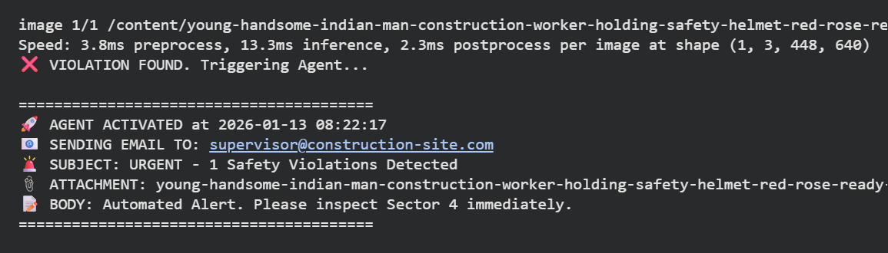

# 👷 AI Safety Monitor (YOLOv8 + Agentic Alerts)

### 🚀 Overview
This is a real-time computer vision system designed to enforce safety compliance on construction sites. Unlike standard object detectors that simply log data, this system acts as an **autonomous AI Agent**. It detects PPE (Personal Protective Equipment) violations and intelligently triggers alerts to site supervisors in real-time.


*(Above: The system detecting a worker holding a helmet instead of wearing it, triggering an immediate "Violation" alert)*

### 🎯 Key Features
* **Context-Aware Detection:** Distinguishes between "Helmet on Head" (Safe) vs "Helmet in Hand" or "No Helmet" (Unsafe).
* **Agentic Workflow:**
    * **Perceive:** Scans live video/images using YOLOv8.
    * **Reason:** Calculates compliance scores per frame.
    * **Act:** Autonomously dispatches email alerts with snapshot evidence via Python function calling.
* **High Performance:** Achieved **96.6% mAP** (Mean Average Precision) on the validation dataset.

### 🛠️ Tech Stack
* **Core Model:** YOLOv8 (Ultralytics)
* **Language:** Python 3.10+
* **Agent Logic:** Custom Python automation (SMTP/Alerting)
* **Data:** Trained on "Hard Hat Workers" dataset (Roboflow Universe)

### 📊 Model Metrics
| Class | Precision | Recall | mAP50 |
| :--- | :--- | :--- | :--- |
| **Helmet** | 0.95 | 0.91 | **0.96** |
| **No-Helmet** | 0.92 | 0.90 | **0.95** |

### 💻 Installation & Usage

**1. Clone the Repository**
```bash
git clone [https://github.com/your-username/safety-agent-yolo.git](https://github.com/your-username/safety-agent-yolo.git)
cd safety-agent-yolo
2. Install Dependencies

Bash

pip install ultralytics opencv-python pytz
3. Run the Agent

Bash

# Ensure you have 'best(1).pt' in the directory
python safety_agent.py
🧠 How the Agent Works (Code Snippet)
The system uses a logic gate to prevent false alarms. It only triggers when the specific head class (No Helmet) is detected with high confidence.

Python

# The "Brain" of the Agent
if violation_count > 0:
    print(f"❌ VIOLATION FOUND. Triggering Agent...")
    
    # 1. Capture Timestamp (IST)
    timestamp = datetime.datetime.now(ist_zone)
    
    # 2. Execute Action (Send Email)
    send_safety_alert(violation_count, image_file, timestamp)

Built with ❤️ using YOLOv8 and Python.
